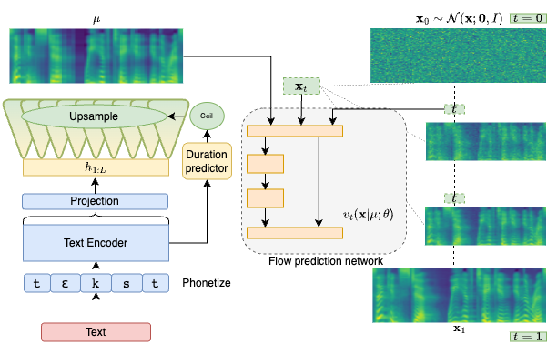

# Matcha-TTS: A fast TTS architecture with conditional flow matching

<head>
  <link rel="icon" type="image/x-icon" href="favicon.ico">
  <meta name="msapplication-TileColor" content="#da532c">
  <meta charset="UTF-8">
  <meta name="theme-color" content="#ffffff">
  <meta property="og:title" content="Matcha-TTS: A fast TTS architecture with conditional flow matching" />
  <meta name="og:description" content="We propose Matcha-TTS, a new approach to non-autoregressive neural TTS, that uses conditional flow matching to speed up ODE-based speech synthesis. Our method is probabilistic, has compact memory footprint, sounds highly natural, is very fast to synthesise from">
  <meta property="og:image" content="images/architecture.png" />
  <meta property="twitter:image" content="images/architecture.png" />
  <meta property="og:type" content="website" />
  <meta property="og:site_name" content="Matcha-TTS" />
  <meta name="twitter:card" content="images/architecture.png" />
  <meta name="viewport" content="width=device-width, initial-scale=1.0">
  <meta name="keywords" content="tts, text to speech, probabilistic machine learning, diffusion models, conditional flow matching, generative modelling, machine learning, deep learning, speech synthesis, research, phd">
  <meta name="description" content="We propose Matcha-TTS, a new approach to non-autoregressive neural TTS, that uses conditional flow matching to speed up ODE-based speech synthesis. Our method is probabilistic, has compact memory footprint, sounds highly natural, is very fast to synthesise from." />
</head>

##### [Shivam Mehta][shivam_profile], [Ruibo Tu][ruibo_profile], [Jonas Beskow][jonas_profile], [Éva Székely][eva_profile], and [Gustav Eje Henter][gustav_profile]

<p style="text-align: center;">
  
</p>

We propose 🍵 Matcha-TTS, a new approach to non-autoregressive neural TTS, that uses conditional flow matching (similar to rectified flows) to speed up ODE-based speech synthesis. Our method:

* Is probabilistic
* Has compact memory footprint
* Sounds highly natural
* Is very fast to synthesise from


Check out our [demo page][this_page]. Read our [arXiv preprint for more details][arxiv_link].
Code is available in our [GitHub repository][github_link], along with pre-trained models.

[Try 🍵 Matcha-TTS on HuggingFace 🤗 spaces!][hf_space]

[shivam_profile]: https://www.kth.se/profile/smehta
[ruibo_profile]: https://www.kth.se/profile/ruibo
[jonas_profile]: https://www.kth.se/profile/beskow
[eva_profile]: https://www.kth.se/profile/szekely
[gustav_profile]: https://people.kth.se/~ghe/
[this_page]: https://shivammehta25.github.io/Matcha-TTS
[arxiv_link]: https://arxiv.org/abs/2309.03199
[grad_tts_paper]: https://arxiv.org/abs/2105.06337
[vits_paper]: https://arxiv.org/abs/2106.06103
[fastspeech2_paper]: https://arxiv.org/abs/2006.04558
[github_link]: https://github.com/shivammehta25/Matcha-TTS
[hf_space]: https://huggingface.co/spaces/shivammehta25/Matcha-TTS

<style type="text/css">
    .tg {
    border-collapse: collapse;
    border-color: #9ABAD9;
    border-spacing: 0;
  }

  .tg td {
    background-color: #EBF5FF;
    border-color: #9ABAD9;
    border-style: solid;
    border-width: 1px;
    color: #444;
    font-family: Arial, sans-serif;
    font-size: 14px;
    overflow: hidden;
    padding: 0px 20px;
    word-break: normal;
    font-weight: bold;
    vertical-align: middle;
    text-align: center;
    white-space: nowrap;
  }

  .tg th {
    background-color: #409cff;
    border-color: #9ABAD9;
    border-style: solid;
    border-width: 1px;
    color: #fff;
    font-family: Arial, sans-serif;
    font-size: 14px;
    font-weight: bold;
    overflow: hidden;
    padding: 0px 20px;
    word-break: normal;
    font-weight: bold;
    vertical-align: middle;
    text-align: center;
    white-space: nowrap;
    margin: auto;
  }

  .tg th a {
    background-color: #409cff;
    color: #fff;
    text-decoration: none;
    font-family: Arial, sans-serif;
    font-size: 14px;
    font-weight: bold;
    overflow: hidden;
    padding: 0px 20px;
    word-break: normal;
    font-weight: bold;
    vertical-align: middle;
    text-align: center;
    white-space: nowrap;
    margin: auto;
  }

  .tg .tg-0pky {
    border-color: inherit;
    text-align: center;
    vertical-align: top,
  }

  td img {
    position: relative;
    margin: 0 auto;
    max-width: 650px;
    padding: 5px;
    border: 0px;
  }

  .tg .tg-fymr {
    border-color: inherit;
    font-weight: bold;
    text-align: center;
    vertical-align: top
  }
  .slider {
  -webkit-appearance: none;
  width: 75%;
  height: 15px;
  border-radius: 5px;
  background: #d3d3d3;
  outline: none;
  opacity: 0.7;
  -webkit-transition: .2s;
  transition: opacity .2s;
}

.slider::-webkit-slider-thumb {
  -webkit-appearance: none;
  appearance: none;
  width: 25px;
  height: 25px;
  border-radius: 50%;
  background: #409cff;
  cursor: pointer;
}

.slider::-moz-range-thumb {
  width: 25px;
  height: 25px;
  border-radius: 50%;
  background: #409cff;
  cursor: pointer;
}

/* audio {
    width: 240px;
} */

/* CSS */
.button-12 {
  display: flex;
  flex-direction: column;
  align-items: center;
  padding: 10px 54px;
  font-family: -apple-system, BlinkMacSystemFont, 'Roboto', sans-serif;
  font-weight: bold;
  border-radius: 6px;
  border: none;

  background: #6E6D70;
  box-shadow: 0px 0.5px 1px rgba(0, 0, 0, 0.1), inset 0px 0.5px 0.5px rgba(255, 255, 255, 0.5), 0px 0px 0px 0.5px rgba(0, 0, 0, 0.12);
  color: #DFDEDF;
  user-select: none;
  -webkit-user-select: none;
  touch-action: manipulation;
}

.button-12:focus {
  box-shadow: inset 0px 0.8px 0px -0.25px rgba(255, 255, 255, 0.2), 0px 0.5px 1px rgba(0, 0, 0, 0.1), 0px 0px 0px 3.5px rgba(58, 108, 217, 0.5);
  outline: 0;
}

audio {
  margin: 0.5em;
}

 .slider {
  -webkit-appearance: none;
  width: 75%;
  height: 15px;
  border-radius: 5px;
  background: #d3d3d3;
  outline: none;
  opacity: 0.7;
  -webkit-transition: .2s;
  transition: opacity .2s;
}

.slider::-webkit-slider-thumb {
  -webkit-appearance: none;
  appearance: none;
  width: 25px;
  height: 25px;
  border-radius: 50%;
  background: #409cff;
  cursor: pointer;
}

.slider::-moz-range-thumb {
  width: 25px;
  height: 25px;
  border-radius: 50%;
  background: #409cff;
  cursor: pointer;
}

</style>

<script src="transcripts.js"></script>

## Architecture



<script>

transcript_listening_test = {
 1: "It had established periodic regular review of the status of four hundred individuals;",    //4
 2: "The narrative of these events is based largely on the recollections of the participants,", // 3
 3: "The jury did not believe him, and the verdict was for the defendants.",    //  7
 4: "One by one the huge uprights of black timber were fitted together,",        // 19
 5: "The position of this palmprint on the carton was parallel with the long axis of the box, and at right angles with the short axis;", //  23
 6: "The boy declared he saw no one, and accordingly passed through without paying the toll of a penny."    // 38
}

function play_audio(filename, audio_id,  condition_name, transcription){

    audio = document.getElementById(audio_id);
    audio_source = document.getElementById(audio_id + "-src");
    block_quote = document.getElementById(audio_id + "-transcript");
    stimulus_span = document.getElementById(audio_id + "-span");

    audio.pause();
    audio_source.src = filename;
    block_quote.innerHTML = transcription;
    stimulus_span.innerHTML = condition_name;
    audio.load();
    audio.play();
}

</script>

## Stimuli from the listening test

> Click the buttons in the table to load and play the different stimuli.

Currently loaded stimulus: <span id="stimuli-from-listening-test-span" style="font-weight: bold;"> MAT-10 : Sentence 1</span>

<p>Audio player: </p>
  <audio id="stimuli-from-listening-test" controls>
    <source id="stimuli-from-listening-test-src" src="stimuli/sample_from_test/MAT-10_1.wav" type="audio/wav">
  </audio>

<p> Transcription: </p>
<blockquote style="height: 60px">
  <p id="stimuli-from-listening-test-transcript">
    It had established periodic regular review of the status of four hundred individuals; 
  </p>
</blockquote>
<table class="tg">
  <thead>
    <tr>
      <th class="tg-0pky">System</th>
      <th class="tg-0pky">Condition</th>
      <th class="tg-0pky">Sentence 1</th>
      <th class="tg-0pky">Sentence 2</th>
      <th class="tg-0pky">Sentence 3</th>
      <th class="tg-0pky">Sentence 4</th>
      <th class="tg-0pky">Sentence 5</th>
      <th class="tg-0pky">Sentence 6</th>
    </tr>
  </thead>
  <tbody>
    <tr>
        <th class="tg-0pky">Vocoded <br> speech</th>
        <th class="tg-0pky">VOC</th>
        <td>  </td>
        <td>  </td>
        <td>  </td>
        <td>  </td>
        <td>  </td>
        <td>  </td>    
    </tr>
    <tr>
        <th class="tg-0pky" rowspan="3"><a href="https://shivammehta25.github.io/Matcha-TTS"> Matcha-TTS</a></th>
        <th class="tg-0pky">MAT-10</th>
        <td>  </td> 
        <td>  </td> 
        <td>  </td> 
        <td>  </td> 
        <td>  </td> 
        <td>  </td> 
    </tr>
    <tr>
        <th class="tg-0pky">MAT-4</th>
        <td>  </td> 
        <td>  </td> 
        <td>  </td> 
        <td>  </td> 
        <td>  </td> 
        <td>  </td>        
    </tr>
    <tr>
        <th class="tg-0pky">MAT-2</th>
        <td>  </td> 
        <td>  </td> 
        <td>  </td> 
        <td>  </td> 
        <td>  </td> 
        <td>  </td>       
    </tr>
    <tr>
        <th class="tg-0pky" rowspan="2"><a href="https://arxiv.org/abs/2105.06337">Grad-TTS</a></th>
        <th class="tg-0pky">GRAD-10</th>
        <td>  </td> 
        <td>  </td> 
        <td>  </td> 
        <td>  </td> 
        <td>  </td> 
        <td>  </td>       
    </tr>
    <tr>
        <th class="tg-0pky">GRAD-4</th>
        <td>  </td> 
        <td>  </td> 
        <td>  </td> 
        <td>  </td> 
        <td>  </td> 
        <td>  </td>       
    </tr>
    <tr>
        <th class="tg-0pky">Grad-TTS+CFM</th>
        <th class="tg-0pky">GCFM-4</th>
        <td>  </td> 
        <td>  </td> 
        <td>  </td> 
        <td>  </td> 
        <td>  </td> 
        <td>  </td>       
    </tr>
    <tr>
        <th class="tg-0pky"><a href="https://arxiv.org/abs/2006.04558">FastSpeech 2</a></th>
        <th class="tg-0pky">FS2</th>
        <td>  </td> 
        <td>  </td> 
        <td>  </td> 
        <td>  </td> 
        <td>  </td> 
        <td>  </td>       
    </tr>
    <tr>
        <th class="tg-0pky"><a href="https://arxiv.org/abs/2106.06103">VITS</a></th>
        <th class="tg-0pky">VITS</th>
        <td>  </td> 
        <td>  </td> 
        <td>  </td> 
        <td>  </td> 
        <td>  </td> 
        <td>  </td>       
    </tr>
  </tbody>
</table>

## Effect of the number of ODE solver steps

<div class="slidecontainer">
  <label for="itr_slider"><span style="font-weight:bold"> 1 </span></label>
  <input type="range" min="1" max="12" value="6" class="slider" id="itr_slider">
  <label for="itr_slider"><span style="font-weight:bold"> 500 </span> </label>
  <p><span style="font-weight:bold">Steps:</span> <span class="itr_val"></span>
  </p>
</div>

<script>

  var itr_slider = document.getElementById("itr_slider");
  var itr_vals = document.getElementsByClassName("itr_val");
  
  // Functions to update values
  var iterations = {
                     1: 1,
                     2: 2,
                     3: 3,
                     4: 4,
                     5: 5,
                     6: 10,
                     7: 15,
                     8: 20,
                     9: 25,
                     10: 50,
                     11: 100,
                     12: 500,
  };
  function updateVals(classes, value){
    for(var i=0; i < classes.length; i++) {
        classes[i].innerHTML= iterations[parseInt(value)];
    }
  }

  let systems = [
      "MAT",
      "GRAD",
      "GCFM"
  ]

  updateVals(itr_vals, 6);
  itr_slider.oninput = function() {
    updateVals(itr_vals, this.value);
    let iteration = iterations[parseInt(this.value)];
    // Update sources


    for (let sent=1; sent <= 3; sent++){
      for (let system_idx = 0; system_idx < systems.length; system_idx++){
        let audio = document.getElementById(systems[system_idx] + "_sent_" + sent);
        let audio_src = document.getElementById( systems[system_idx] + "_sent_src_" + sent);

        audio_src.src = "stimuli/number_of_ode_solver/" + systems[system_idx] + "-" + iteration + "_" + sent + ".wav";
        audio.load();        

      }
    }
  }
</script>

<table class="tg">
  <thead>
    <tr>
      <th class="tg-0pky">System</th>
      <th class="tg-0pky">Sentence 1</th>
      <th class="tg-0pky">Sentence 2</th>
      <th class="tg-0pky">Sentence 3</th>
    </tr>
  </thead>
  <tbody>
    <tr>
      <th class="tg-0pky"><a href="https://shivammehta25.github.io/Matcha-TTS">Matcha-TTS</a></th>
      <td>
        <audio id="MAT_sent_1" controls>
            <source id="MAT_sent_src_1" src="stimuli/number_of_ode_solver/MAT-10_1.wav" type="audio/wav">
        </audio>
      </td>
      <td>
        <audio id="MAT_sent_2" controls>
            <source id="MAT_sent_src_2" src="stimuli/number_of_ode_solver/MAT-10_2.wav" type="audio/wav">
        </audio>
      </td>
      <td>
        <audio id="MAT_sent_3" controls>
            <source id="MAT_sent_src_3" src="stimuli/sample_from_test/MAT-10_3.wav" type="audio/wav">
        </audio>
      </td>
    </tr>
    <tr>
      <th class="tg-0pky"><a href="https://arxiv.org/abs/2105.06337">Grad-TTS</a></th>
      <td>
        <audio id="GRAD_sent_1" controls>
            <source id="GRAD_sent_src_1" src="stimuli/number_of_ode_solver/GRAD-10_1.wav" type="audio/wav">
        </audio>
      </td>
      <td>
        <audio id="GRAD_sent_2" controls>
            <source id="GRAD_sent_src_2" src="stimuli/number_of_ode_solver/GRAD-10_2.wav" type="audio/wav">
        </audio>
      </td>
      <td>
        <audio id="GRAD_sent_3" controls>
            <source id="GRAD_sent_src_3" src="stimuli/number_of_ode_solver/GRAD-10_3.wav" type="audio/wav">
        </audio>
      </td>
    </tr>
    <tr>
      <th class="tg-0pky">Grad-TTS + CFM</th>
      <td>
        <audio id="GCFM_sent_1" controls>
            <source id="GCFM_sent_src_1" src="stimuli/number_of_ode_solver/GCFM-10_1.wav" type="audio/wav">
        </audio>
      </td>
      <td>
        <audio id="GCFM_sent_2" controls>
            <source id="GCFM_sent_src_2" src="stimuli/number_of_ode_solver/GCFM-10_2.wav" type="audio/wav">
        </audio>
      </td>
      <td>
        <audio id="GCFM_sent_3" controls>
            <source id="GCFM_sent_src_3" src="stimuli/number_of_ode_solver/GCFM-10_3.wav" type="audio/wav">
        </audio>
      </td>
    </tr>

  </tbody>
</table>

## Citation information

```
@article{mehta2023matcha,
  title={Matcha-TTS: A fast TTS architecture with conditional flow matching},
  author={Mehta, Shivam and Tu, Ruibo and Beskow, Jonas and Sz{\'e}kely, {\'E}va and Henter, Gustav Eje},
  journal={arXiv preprint arXiv:2309.03199},
  year={2023}
}
```


[][this_page]
